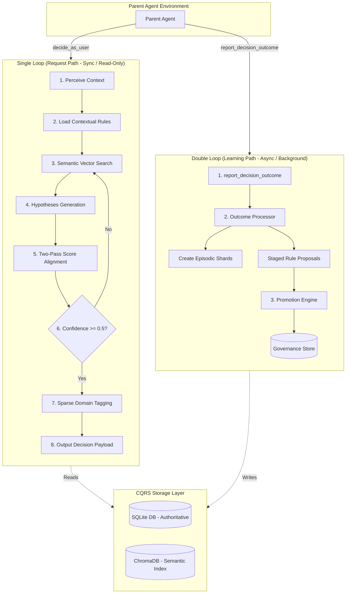

# 🧠 Cognitive Twin Sub-Agent

A pluggable **"Brain & Conscience" sub-agent** for Parent Agents. It predicts, aligns, and refines decisions based on a user's unique persona, values, and historical behaviors.


Note from Human: Currently working on parser and planned to update twin logic. the logic is yet fragile and has much ambiguity. Hope someone sees this and get inspired to become next Bill Gates Haha
---

## 🏛️ System Architecture

The agent operates on a **Double-Loop Architecture**, splitting fast decision paths from slow background learning paths to maintain low-latency responses.



### The Double-Loop at a Glance

| Loop | Type | Frequency | Mutation Policy | Primary Goal |
| :--- | :--- | :--- | :--- | :--- |
| **Single Loop** | Synchronous | Every request | **Read-Only** | Predict & align decision |
| **Double Loop** | Asynchronous | Background | **Writes & Updates** | Synthesize outcomes & adapt rules |

---

## ⚡ Quick Start: Agent-in-the-Loop Local Simulation (Zero Cost)

This project features a groundbreaking **Agent-in-the-Loop Coupling Mode** (`COGNITIVE_LLM_PROVIDER=agent`). Instead of paying for API keys, this mode allows you to pair program with your AI coding assistant (such as Gemini, Claude, Cursor, or VS Code agents) in a closed feedback loop:

1. **How it Works**: The program halts on every LLM call, prints a structured Pydantic schema to `stdout`, and waits for a JSON response on `stdin`.
2. **AI Interception**: The AI agent executing your terminal commands reads these prompts in real-time, reasons through the context, and **automatically injects the correct Pydantic JSON responses into the terminal stdin**.
3. **The Result**: You can simulate the entire LangGraph flow, SQLite database writes, Chroma vector searches, and double-loop meta-learning dynamically at **$0 cost** and with **zero network latency**!

---

### Option A: The One-Command Run (Recommended)
Use the automated helper script [run_sim.sh](file:///run_sim.sh) to verify/install all required dependencies and start the interactive agent simulation in one command:

```bash
./run_sim.sh
```

#### testing different scenarios
You can pass flags directly to the script to test different cognitive paths:
* **Set A (AI Safety Sycophancy Rejection Flow)**: `./run_sim.sh --set A`
* **Set B (Precise Journalism Rejection Flow - Default)**: `./run_sim.sh --set B`
* **Set C (Creative Sci-Fi Sound Currency Acceptance Flow)**: `./run_sim.sh --set C`
* **Persist SQLite/Chroma Database**: `./run_sim.sh --db ./test_twin.db` *(prevents using temporary folders and saves SQLite/Chroma files directly in your workspace)*

---

### Option B: Manual Step-by-Step Run

#### 1. Setup Environment
Copy the example configuration file and ensure the provider is set to `agent`:
```bash
cp .env.example .env
```
Confirm `.env` is configured with:
```ini
COGNITIVE_LLM_PROVIDER=agent
```

#### 2. Install Dependencies
```bash
pip3 install -r requirements.txt
```

#### 3. Run the Simulation
```bash
python3 data_pipeline/run.py
```
*(To run a fast smoke test that bypasses all subagent execution entirely, run `python3 data_pipeline/run.py --no-llm`)*

---

### 🧪 Running the Local Test Suite
To verify the AUTHORITATIVE SQLite and Chroma database operations without running the simulation, execute our comprehensive local test suite:

```bash
# Run the 38 DB storage integration tests
pytest tests/test_storage.py

# Run the entire test suite of 298 tests
pytest
```

---

## 🔌 Integration Reference

To attach this sub-agent to your Parent Agent, register the structured tools in your pipeline:

```python
from src.storage.db import open_db, init_schema
from src.deps import Stores
from src.graph import build_graph
from src.tools import make_tools

# 1. Initialize Dual-Write Stores
conn = open_db("cognitive_twin.db")
init_schema(conn)
stores = Stores(conn=conn, chroma_persist_dir="./chroma_index")  # Injected stores container

# 2. Compile LangGraph and make tools
compiled_graph = build_graph(stores)
tools = make_tools(stores, compiled_graph)

# 3. Register tools to your agent
parent_agent.register_tools(tools)
```

---

> 📝 For a deep-dive into code structure, node logic, and design decisions, see the full [ARCHITECT.md](file:///Users/sehyeokpark/Desktop/Lets%20Learn/Lets%20Make/Cognitive/ARCHITECT.md) file.
