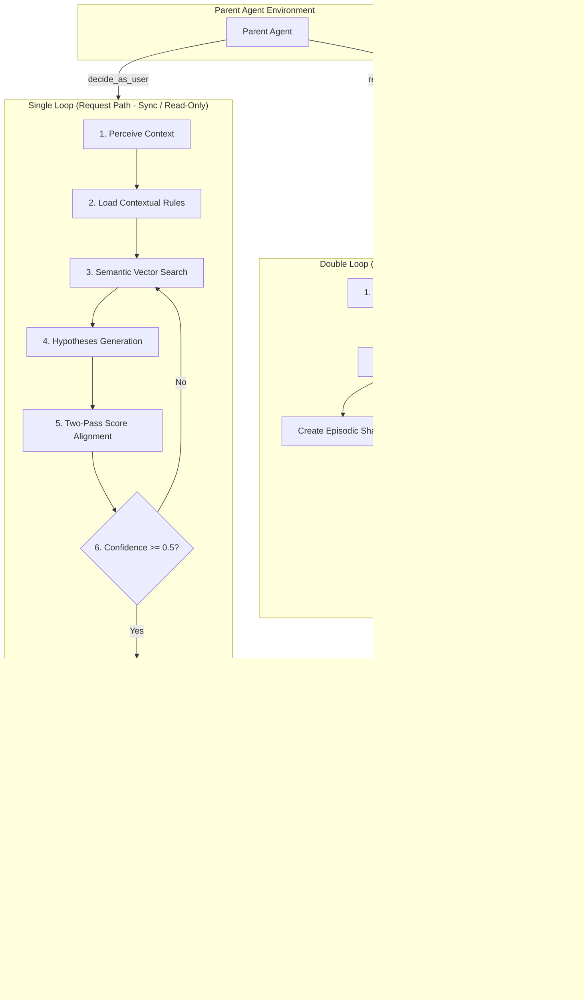

# 🧠 Cognitive Twin Sub-Agent

A pluggable **"Brain & Conscience" sub-agent** for Parent Agents. It predicts, aligns, and refines decisions based on a user's unique persona, values, and historical behaviors.


WORK-IN-PROGRESS: PARSER FOR LLM EXTRACTION
---

## 🏛️ System Architecture

The agent operates on a **Double-Loop Architecture**, splitting fast decision paths from slow background learning paths to maintain low-latency responses.



### The Double-Loop at a Glance

| Loop | Type | Frequency | Mutation Policy | Primary Goal |
| :--- | :--- | :--- | :--- | :--- |
| **Single Loop** | Synchronous | Every request | **Read-Only** | Predict & align decision |
| **Double Loop** | Asynchronous | Background | **Writes & Updates** | Synthesize outcomes & adapt rules |

---

## ⚡ Quick Start in 2 Steps

The repository includes [run.py](file:///Users/sehyeokpark/Desktop/Lets%20Learn/Lets%20Make/Cognitive/run.py) to easily run mock scenarios and test the system locally.

### 1. Install Dependencies
```bash
pip install -r requirements.txt
```

### 2. Run local verification smoke test (No API keys or network required)
```bash
python run.py --no-llm
```

> [!TIP]
> To run in **Live Mode** using real LLM models, copy `.env.example` to `.env`, set your API keys, and run:
> ```bash
> python run.py
> ```

---

## 🔌 Integration Reference

To attach this sub-agent to your Parent Agent, register the structured tools in your pipeline:

```python
from src.storage.db import open_db, init_schema
from src.deps import Stores
from src.graph import build_graph
from src.tools import make_tools

# 1. Initialize Dual-Write Stores
conn = open_db("cognitive_twin.db")
init_schema(conn)
stores = Stores(conn=conn, chroma_persist_dir="./chroma_index")  # Injected stores container

# 2. Compile LangGraph and make tools
compiled_graph = build_graph(stores)
tools = make_tools(stores, compiled_graph)

# 3. Register tools to your agent
parent_agent.register_tools(tools)
```

---

> 📝 For a deep-dive into code structure, node logic, and design decisions, see the full [ARCHITECT.md](file:///Users/sehyeokpark/Desktop/Lets%20Learn/Lets%20Make/Cognitive/ARCHITECT.md) file.
