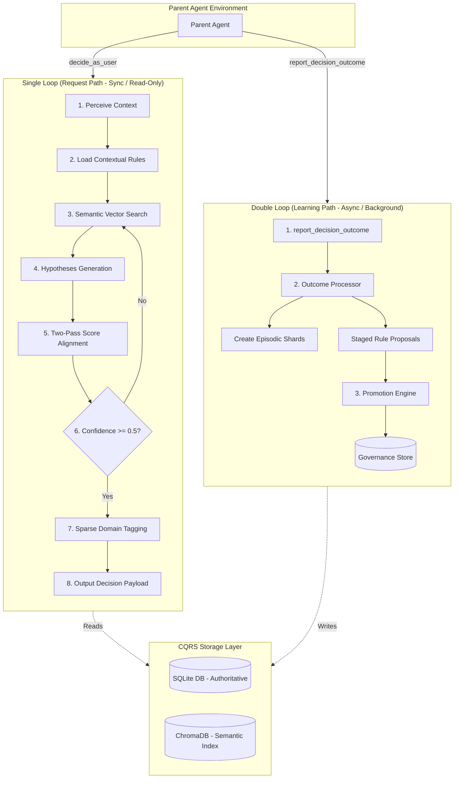

# 🧠 Cognitive Twin Sub-Agent

A pluggable **"Brain & Conscience" sub-agent** for Parent Agents. It predicts, aligns, and refines decisions based on a user's unique persona, values, and historical behaviors.

---

## 🏛️ System Architecture

The agent operates on a **Double-Loop Architecture**, splitting fast decision paths from slow background learning paths to maintain low-latency responses.



### The Double-Loop at a Glance

| Loop | Type | Frequency | Mutation Policy | Primary Goal |
| :--- | :--- | :--- | :--- | :--- |
| **Single Loop** | Synchronous | Every request | **Read-Only** | Predict & align decision |
| **Double Loop** | Asynchronous | Background | **Writes & Updates** | Synthesize outcomes & adapt rules |

---

## ⚡ Quick Start (Zero-Cost Local Simulation)

This project features a high-fidelity **Interactive Agent Mode** (`COGNITIVE_LLM_PROVIDER=agent`). Instead of paying for API keys or relying on hardcoded static mocks, this mode halts execution on LLM calls, prints structured Pydantic schemas, and reads responses from `stdin`. 

This is incredibly powerful for:
1. **Manual Dry-Runs**: Play the role of the LLM by feeding your own custom JSON responses in the terminal.
2. **Agent-in-the-Loop Coupling (Recommended)**: If you run the pipeline using a terminal-aware AI coding assistant (like Gemini, Claude, or Cursor agents), **the AI agent can automatically intercept the stdout prompt and inject its own high-quality Pydantic JSON responses into the terminal stdin**, dynamically driving the pipeline for free!

---

### Option A: Run everything with the Automated Script (Recommended)
We include a [run_sim.sh](file:///run_sim.sh) helper script that automatically verifies/installs Python dependencies (`requirements.txt`) and boots the local interactive simulator in one command:

```bash
./run_sim.sh
```

#### Running Different Scenarios & Persisting Data
You can pass arguments directly to the script to test different cognitive behaviors:
* **Set A (AI Safety Sycophancy Rejection Flow)**: `./run_sim.sh --set A`
* **Set B (Precise Journalism Rejection Flow - Default)**: `./run_sim.sh --set B`
* **Set C (Creative Sci-Fi Sound Currency Acceptance Flow)**: `./run_sim.sh --set C`
* **Persist SQLite/Chroma Database**: `./run_sim.sh --db ./test_twin.db` *(saves database files locally instead of using a temporary folder)*

---

### Option B: Run step-by-step manually

#### 1. Setup Environment
Copy the example environment file and set the provider to `agent`:
```bash
cp .env.example .env
```
Ensure `.env` contains:
```ini
COGNITIVE_LLM_PROVIDER=agent
```

#### 2. Install Dependencies
```bash
pip3 install -r requirements.txt
```

#### 3. Run the Simulation
```bash
python3 data_pipeline/run.py
```
*(To run a fast smoke test that bypasses all subagent execution entirely, run `python3 data_pipeline/run.py --no-llm`)*

---

### 🧪 Running the Local Test Suite
To verify database mutations, SQLite schemas, Chroma vector search, and dual-loop outcome processing locally, run the comprehensive unit/integration test suite:

```bash
# Run DB storage tests only (38 tests)
pytest tests/test_storage.py

# Run entire test suite (298 tests)
pytest
```

---

## 🔌 Integration Reference

To attach this sub-agent to your Parent Agent, register the structured tools in your pipeline:

```python
from src.storage.db import open_db, init_schema
from src.deps import Stores
from src.graph import build_graph
from src.tools import make_tools

# 1. Initialize Dual-Write Stores
conn = open_db("cognitive_twin.db")
init_schema(conn)
stores = Stores(conn=conn, chroma_persist_dir="./chroma_index")  # Injected stores container

# 2. Compile LangGraph and make tools
compiled_graph = build_graph(stores)
tools = make_tools(stores, compiled_graph)

# 3. Register tools to your agent
parent_agent.register_tools(tools)
```

---

> 📝 For a deep-dive into code structure, node logic, and design decisions, see the full [ARCHITECT.md](file:///Users/sehyeokpark/Desktop/Lets%20Learn/Lets%20Make/Cognitive/ARCHITECT.md) file.
